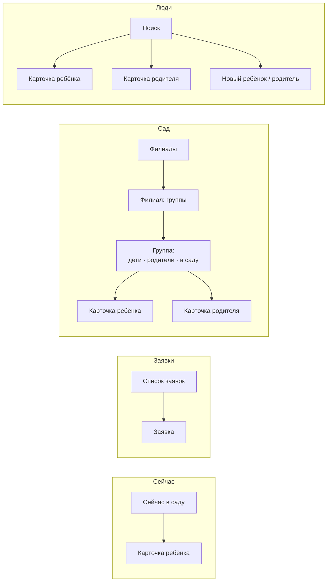

# Экраны администратора

25.09.2026 · Darya Nesterova

После входа пользователь с ролью `ADMIN` попадает не на «Мои дети», а в раздел администратора. Там он подтверждает заявки на регистрацию, заводит детей и родителей, связывает их, ведёт филиалы и группы и видит, кто сейчас в саду.

**Статус: проработано, не реализовано.** API сверено со стендом `http://93.77.168.178/api/v3/api-docs` и кодом `visit-control-service` на 25.09.2026. Примерно половину экранов можно сделать на текущем API. Остальным нужны доработки бэкенда, они собраны в разделе «Что нужно на бэкенде».

## Куда попадает пользователь после входа

Роль приходит в `GET /user` (`role.role`) и уже лежит в `state.auth.user.role`.

| Роль | Экран после входа |
| --- | --- |
| `ADMIN` | вкладка «Сейчас» раздела администратора |
| `PARENT` | «Мои дети» (`docs/children-screen.md`) |
| остальные | «Приложение пока работает для родителей и администраторов» и кнопка «Выйти» |

Проверка роли на клиенте только выбирает экраны, настоящая защита — права на бэкенде. Если администратор одновременно чей-то родитель, свои дети доступны ему во вкладке «Ещё» → «Мои дети».

## Вкладки

Пять вкладок внизу экрана: больше в нижнюю панель не помещается без сокращений.

| Вкладка | Что внутри | Зачем отдельная вкладка |
| --- | --- | --- |
| **Сейчас** | дети, которые сейчас в саду, по группам | самый частый вопрос: сколько детей и кто где |
| **Заявки** | заявки на регистрацию; число ожидающих — на значке вкладки | ежедневная работа, должна быть в один тап |
| **Сад** | филиалы → группы → состав группы | структура сада и работа с группами |
| **Люди** | поиск по всем детям и родителям, создание, карточки | когда нужен конкретный человек, а не группа |
| **Ещё** | журнал посещений, мои дети, смена пароля, выход | редкие действия |

```
┌─────────────────────────────────────┐
│                                     │
│            (содержимое)             │
│                                     │
├───────┬───────┬───────┬──────┬──────┤
│  ◉    │  ✉ 3  │  ⌂    │  👤  │  ⋯   │
│Сейчас │Заявки │  Сад  │ Люди │ Ещё  │
└───────┴───────┴───────┴──────┴──────┘
```

Внутри каждой вкладки свой стек экранов: из «Сад» можно уйти вглубь до карточки ребёнка, переключиться на «Заявки» и вернуться в «Сад» туда же, где был.



Карточки ребёнка и родителя — одни и те же экраны, открытые из разных вкладок.

## Сейчас

```
┌─────────────────────────────────────┐
│  Сейчас в саду                      │
│  Филиал: Центральный            ▾   │
│                                     │
│  В саду 23 ребёнка                  │
│                                     │
│  СОЛНЫШКО · 8 из 15                 │
│  Мария Иванова                    › │
│  Пётр Смирнов                     › │
│  …                                  │
│  РОМАШКА · 15 из 18                 │
│  …                                  │
└─────────────────────────────────────┘
```

- Дети разбиты по группам, у группы — «сейчас / всего». Нажатие на ребёнка открывает его карточку.
- Если филиалов несколько, сверху выбор филиала, по умолчанию последний выбранный.
- Обновление: потянуть вниз и при каждом возврате на вкладку, как на «Мои дети».
- **Сейчас в API:** `GET /group/children/present` отдаёт плоский список детей без группы и филиала. Первая версия вкладки — алфавитный список и общее число. Разбивка по группам появится после доработки бэкенда.

## Заявки

```
┌─────────────────────────────────────┐
│  Заявки                             │
│                                     │
│  Иванова Мария Петровна             │
│  maria@mail.ru · +7 912 345-67-89   │
│  24 сентября, 18:40               › │
│  ─────────────────────────────────  │
│  Смирнов Олег                       │
│  …                                  │
└─────────────────────────────────────┘

┌─────────────────────────────────────┐
│  ← Заявка                           │
│                                     │
│  Иванова Мария Петровна             │
│  Дата рождения   12.03.1990         │
│  Пол             женский            │
│  Email           maria@mail.ru      │
│  Телефон         +7 912 345-67-89   │
│  Подана          24.09.2026 18:40   │
│                                     │
│  ┌───────────────────────────────┐  │
│  │          Подтвердить          │  │
│  └───────────────────────────────┘  │
│           Отклонить                 │
└─────────────────────────────────────┘
```

- Список — `GET /registration/requests` с пагинацией, число на значке вкладки — `totalElements`.
- «Подтвердить» → `POST /registration/requests/{key}/approve`. После ответа экран предлагает следующий шаг: «Мария может войти. Привязать её к ребёнку?» → поиск ребёнка (см. «Связь ребёнка и представителя»). Без связи родитель увидит пустой экран «Мои дети».
- Если в ответе `password_sent: false`, показываем «Письмо с паролем не отправилось» и кнопку «Отправить пароль ещё раз» (`POST /user/{key}/password/reset`).
- «Отклонить» → диалог с необязательной причиной (до 500 символов) → `POST /registration/requests/{key}/reject`.
- Похожий пользователь уже есть (тот же телефон или ФИО и дата рождения) — предупреждение над кнопками. **Нужен бэкенд**: сейчас сервер проверяет только занятость email и телефона при подаче.
- **Сейчас в API:** всё, кроме проверки на дубли, есть.

## Сад: филиалы и группы

```
┌─────────────────────────────────────┐
│  Филиалы                        ＋  │
│                                     │
│  Центральный                      › │
│  4 группы                           │
│  ─────────────────────────────────  │
│  На Лесной                        › │
│  2 группы                           │
└─────────────────────────────────────┘

┌─────────────────────────────────────┐
│  ← Центральный                  ⋯   │
│                                     │
│  Солнышко                         › │
│  15 детей · в саду 8                │
│  ─────────────────────────────────  │
│  Ромашка                          › │
│  18 детей · в саду 15               │
│                                     │
│  ＋ Добавить группу                 │
└─────────────────────────────────────┘
```

**Филиалы.** Список — `GET /branch/list`. «＋» — диалог с названием → `POST /branch`. В меню «⋯» филиала: «Переименовать» (`PUT /branch/{key}`) и «Удалить» (`DELETE /branch/{key}`). Удаление — с подтверждением «Удалить филиал „Центральный“?». Сейчас сервер удаляет филиал, даже если в нём есть группы, и группы остаются без филиала. Нужно, чтобы бэкенд отвечал 409 на удаление непустого филиала, а приложение показывало «Сначала удалите или перенесите группы».

**Группы филиала.** Список — `GET /branch/{key}/groups`. Создание, переименование и удаление групп устроены так же, как у филиалов. **Нужен бэкенд**: эндпоинтов для записи групп нет, есть только чтение.

**Группа.** Экран с переключателем из трёх частей (тот же `segmented-control`, что в регистрации):

```
┌─────────────────────────────────────┐
│  ← Солнышко                     ⋯   │
│  ┌──────────┬───────────┬────────┐  │
│  │ Дети 15 ●│ Родители  │ В саду │  │
│  └──────────┴───────────┴────────┘  │
│                                     │
│  ● Мария Иванова                  › │
│  ○ Пётр Смирнов                   › │
│  …                                  │
│  ＋ Добавить ребёнка в группу       │
└─────────────────────────────────────┘
```

- **Дети** — все дети группы; точка показывает, в саду ли ребёнок сейчас. «＋ Добавить ребёнка» открывает поиск по детям без группы или предлагает создать нового.
- **Родители** — представители детей этой группы, у каждого подпись «мама Марии», «бабушка Петра» (роль связи). Отсюда удобно найти, кому звонить.
- **В саду** — только дети со статусом `IN`.
- В меню «⋯» — переименовать и удалить группу. Удалить можно только пустую группу, иначе сообщение «В группе 15 детей. Переведите их в другие группы».

**Нужен бэкенд** для всех трёх частей: в БД есть таблица `group_user`, но API для состава группы нет.

## Люди

```
┌─────────────────────────────────────┐
│  Люди                           ＋  │
│  ┌───────────────────────────────┐  │
│  │ 🔍 Фамилия, телефон, email     │  │
│  └───────────────────────────────┘  │
│  ┌────────┬──────────┬──────────┐   │
│  │ Дети ● │ Взрослые │ Отключены│   │
│  └────────┴──────────┴──────────┘   │
│                                     │
│  Иванова Мария · Солнышко         › │
│  Смирнов Пётр · Ромашка           › │
│  …                                  │
└─────────────────────────────────────┘
```

- Поиск по фамилии, имени, телефону и email; фильтр «Дети / Взрослые / Отключены». Подгрузка страницами при прокрутке.
- «＋» — выбор: «Ребёнок» или «Взрослый (родитель, родственник)».
- **Сейчас в API:** `GET /user/list` отдаёт всех пользователей страницами, без поиска и фильтров. Фильтровать на клиенте можно только загруженные страницы, это не годится уже при паре сотен человек. **Нужен бэкенд**: параметры `q`, `role`, `status`.

### Новый ребёнок

Одна форма из трёх блоков, поля и проверки — как в регистрации (`form-field`, маска даты, переключатель пола):

1. **О ребёнке:** фамилия, имя, отчество (или «Нет отчества»), дата рождения, пол. Email и телефона у ребёнка нет.
2. **Группа:** выбор филиала и группы. Можно пропустить.
3. **Представители:** «＋ Добавить» → поиск взрослого → выбор роли связи (родитель, родственник, знакомый). Можно пропустить.

Сохранение: `POST /user` с ролью `VISITOR` → затем добавление в группу → затем `POST /child-representative` на каждого представителя. Если упал второй или третий шаг, ребёнок уже создан. Тогда экран открывает его карточку с сообщением «Ребёнок создан, но не удалось добавить: …», а не показывает ошибку всей формы. Иначе повторное нажатие «Сохранить» создаст второго ребёнка.

**Нужен бэкенд**: `POST /user` принимает роль по `external_key`, а список ролей получить нечем. Нужен `GET /role/list` или приём роли по имени.

### Новый взрослый

Те же поля, что в регистрации, плюс обязательный email: на него придёт пароль (`POST /user` сам генерирует и отправляет пароль). Согласие на обработку ПДн администратор за человека не даёт. Поэтому обычный путь для родителя — заявка из приложения, а ручное создание — для тех, кто не может подать заявку сам. Юридическую сторону такого варианта нужно уточнить (см. «Открытые вопросы»).

## Карточка ребёнка

```
┌─────────────────────────────────────┐
│  ← Мария Иванова                ⋯   │
│                                     │
│  ● В саду с 8:40 · привела мама     │
│                                     │
│  Дата рождения   05.06.2021 (5 лет) │
│  Группа          Солнышко        ›  │
│                                     │
│  ПРЕДСТАВИТЕЛИ                      │
│  Иванова Анна · мама              › │
│  Иванов Олег · папа               › │
│  Петрова Нина · бабушка           › │
│  ＋ Добавить представителя          │
│                                     │
│  ПОСЛЕДНИЕ ОТМЕТКИ                  │
│  25.09 8:40  пришла · Иванова А.    │
│  24.09 17:30 ушла · Иванов О.       │
│  Вся история                      › │
└─────────────────────────────────────┘
```

- Статус — `GET /visit/actual_status/{key}`. Время и «кто привёл» появятся после той же доработки, что нужна экрану «Мои дети».
- Представители — `GET /child-representative/representatives`; ФИО уже приходят в ответе. Свайп или меню у строки → «Отвязать» (`DELETE /child-representative`) с подтверждением.
- В меню «⋯»: «Редактировать», «Перевести в другую группу», «Отключить».
- **Нужен бэкенд:** получение пользователя по ключу (`GET /user/{key}`) для шапки карточки, группа ребёнка, история отметок по ребёнку (фильтр `visitor_external_key` у `/visit/list`), редактирование (`PUT /user` сейчас ничего не делает).

## Карточка родителя

Устроена так же: контакты с кнопками «Позвонить» и «Написать» (`tel:` и `mailto:`), статус учётной записи, список его детей с ролью связи (`GET /child-representative/children`), история согласий на обработку ПДн (`GET /user/{key}/consents`).

В меню «⋯»: «Редактировать», «Отправить новый пароль» (`POST /user/{key}/password/reset` — есть), «Отключить».

## Связь ребёнка и представителя

Связь создаётся с двух сторон: из карточки ребёнка («＋ Добавить представителя») и из карточки родителя («＋ Добавить ребёнка»). В обоих случаях поиск человека, затем выбор роли связи:

| Роль связи | Подпись в интерфейсе | Что может представитель |
| --- | --- | --- |
| `PARENT` | родитель | видит ребёнка, отмечает приход и уход |
| `RELATIVE` | родственник | то же |
| `ACQUAINTANCE` | знакомый (няня, сосед) | то же. Ограничивать ли его, пока не решено (открытый вопрос в `children-screen.md`) |

`POST /child-representative` и `DELETE /child-representative` уже есть. Повторная связь даёт 409, приложение показывает «Этот человек уже привязан к ребёнку».

## Отключение детей и родителей

Отключение, а не удаление: ребёнок выбыл из сада, родитель больше не должен забирать ребёнка. История посещений при этом остаётся.

- **Ребёнок** пропадает из групп, из «Сейчас» и из «Мои дети» у всех представителей. Отметить его нельзя.
- **Взрослый** не может войти, а отметки от его имени не принимаются.
- Отключённые видны в «Люди» → «Отключены», там же кнопка «Включить».
- Подтверждение с последствиями: «Отключить Марию Иванову? Она пропадёт из группы „Солнышко“ и у трёх представителей».

**Нужен бэкенд.** Эндпоинта нет. Статус `DELETED` для этого не подходит: так помечаются учётные записи после отзыва согласия на обработку ПДн, и такие записи не восстанавливают. Нужен отдельный обратимый статус, например `BLOCKED`, и `POST /user/{key}/block` и `/unblock`. Отдельно: JWT живёт 24 часа. Если сервер не проверяет статус пользователя при каждом запросе, отключённый родитель ещё сутки сможет отмечать детей.

## Ещё

- **Журнал посещений** — `GET /visit/list`, новые сверху. Пока без фильтров. Потом нужны фильтры по дате, группе и ребёнку.
- **Мои дети** — если администратор сам родитель.
- **Сменить пароль**, **Выйти**.

## Состояния и ошибки

Общие правила для всех экранов раздела, чтобы не описывать их на каждом:

| Ситуация | Поведение |
| --- | --- |
| Загрузка списка | Спиннер по центру; при повторной загрузке список остаётся на месте, крутится `RefreshControl` |
| Пустой список | Текст по смыслу («Новых заявок нет», «В группе пока нет детей») и основное действие, если оно есть |
| Ошибка загрузки | «Не удалось загрузить данные» и «Повторить» |
| Удаление, отключение, отклонение | Всегда диалог подтверждения с названием объекта и последствиями |
| Создание и редактирование | Кнопка блокируется до ответа; без автоматических повторов, как у регистрации |
| 403 | «Недостаточно прав» — если роль сменили, пока приложение было открыто |
| 409 | Текст по коду ошибки из ответа: «Email уже занят», «Филиал не пустой», «Уже привязан» |

## Реализация в приложении

**Маршруты** (expo-router, группа `(admin)` с вкладками, в каждой вкладке свой стек):

```
app/(admin)/_layout.tsx            Tabs, значок с числом заявок
app/(admin)/now/index.tsx          Сейчас в саду
app/(admin)/requests/index.tsx     Заявки
app/(admin)/requests/[id].tsx      Заявка
app/(admin)/garden/index.tsx       Филиалы
app/(admin)/garden/[branchId].tsx  Группы филиала
app/(admin)/garden/group/[groupId].tsx
app/(admin)/people/index.tsx       Поиск
app/(admin)/people/new-child.tsx
app/(admin)/people/new-adult.tsx
app/(admin)/more/index.tsx
app/child/[id].tsx                 Карточка ребёнка — общая для всех вкладок
app/adult/[id].tsx                 Карточка взрослого
```

После входа `auth.tsx` выбирает маршрут по `user.role` вместо безусловного `/children`.

**Данные.** В разделе администратора около 25 запросов, и почти все — чтение списков и запись с последующим обновлением этих списков. Если писать для каждого slice, saga и флаги загрузки, как в `registration` и `children`, получится несколько тысяч строк однотипного кода. Предлагаю для этого раздела RTK Query: он уже входит в `@reduxjs/toolkit`, новых зависимостей не нужно. Поверх текущего `visitControlApi` он работает через свой `baseQuery`, так что Bearer, 401 и ретраи остаются общими. Он кэширует ответы, считает `isLoading` и `isFetching` и после изменений сам перечитывает затронутые списки через теги (`invalidatesTags: ['Branch']`). Для «Мои дети» saga остаётся: там особая логика проверки статуса перед отметкой.

Это отступление от паттерна в `memory-bank/systemPatterns.md`. Если решим так делать, его нужно дописать туда.

## Что нужно на бэкенде

По убыванию важности для раздела:

| Доработка | Для какого экрана |
| --- | --- |
| `GET /role/list` или приём роли по имени в `POST /user` и `POST /child-representative` | создание детей и взрослых, связи |
| `GET /user/{key}` | карточки ребёнка и взрослого |
| Фильтры `GET /user/list`: `q` (ФИО, телефон, email), `role`, `status` | Люди, поиск при создании связи |
| Группы: `POST /group`, `PUT /group/{key}`, `DELETE /group/{key}` (409, если в группе есть дети) | Сад |
| Состав группы: `GET /group/{key}/children`, добавить и убрать ребёнка, группа ребёнка в `UserDto` | Сад, карточка ребёнка, новый ребёнок |
| Представители детей группы: `GET /group/{key}/representatives` | Сад → «Родители» |
| `group` и `branch` у детей в `/group/children/present`, фильтр по филиалу | Сейчас |
| Обратимое отключение пользователя (`BLOCKED`, `block` и `unblock`) и проверка статуса при каждом запросе | Отключение |
| Реализовать `PUT /user/{key}` — сейчас метод пустой | Редактирование |
| 409 на удаление филиала с активными группами | Сад |
| Фильтры `/visit/list`: `visitor_external_key`, `group_external_key`, даты | Карточка ребёнка, журнал |
| Поиск возможных дублей при подтверждении заявки | Заявки |

## Порядок работ

1. **Каркас и то, что работает на текущем API:** выбор экрана по роли, вкладки, «Заявки» целиком, филиалы (список, создание, переименование, удаление), список групп филиала, «Сейчас» плоским списком, журнал, карточка родителя со связями и сбросом пароля.
2. **После ролей, `GET /user/{key}` и фильтров пользователей:** «Люди», создание детей и взрослых, связи, карточка ребёнка.
3. **После API групп:** управление группами, состав группы, «Родители» и «В саду» в группе, «Сейчас» по группам.
4. **После обратимого отключения:** отключение и включение детей и взрослых.

## Открытые вопросы

- Нужен ли администратору весь этот функционал в телефоне, или часть (создание филиалов, массовое заведение детей в начале года) удобнее в веб-админке? Экраны на React Native можно собрать и под веб (`expo start --web`), но таблицы на сотни строк и массовые операции там всё равно придётся делать отдельно.
- Нужна ли роль «Воспитатель», которая видит только свою группу: кто в саду, кто кого забрал? Сейчас такой роли нет, есть только `ADMIN` с полными правами.
- Может ли администратор создать взрослого вручную без согласия на обработку ПДн от самого человека? Если нет, остаётся только заявка из приложения, а «Новый взрослый» превращается в «Пригласить по email».
- Может ли ребёнок быть в двух группах одновременно (например, основная группа и вечерняя)? От ответа зависит, одна группа в карточке или список.
- Кто может отметить ребёнка вместо родителя? Например, администратор утром отмечает всех пришедших, если родитель забыл.
