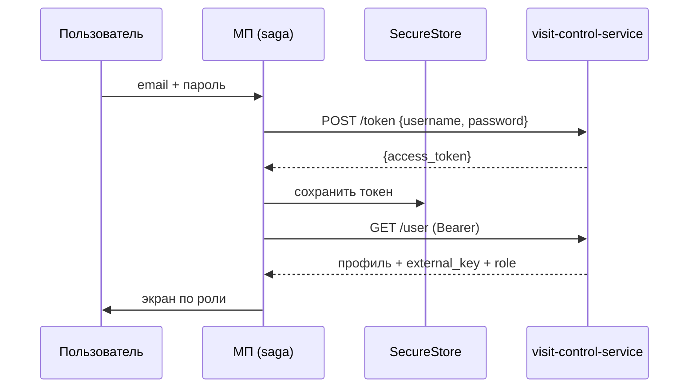
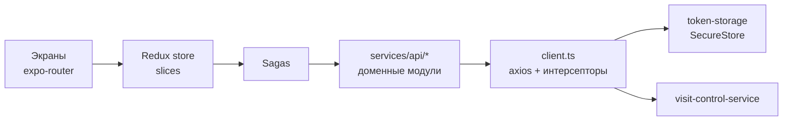
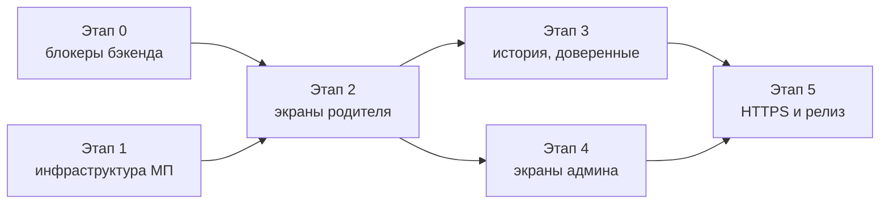

# VisitControlApp: интеграция с visit-control-service

23.09.2026

## Контекст и цель

Цель: заменить мок авторизации в VisitControlApp на реальный вход через `POST /token` бэкенда и построить поверх него экраны посещений. Бэкенд готов на уровне API, мобильному приложению не хватает слоя данных под этот API.

**Мобильное приложение (VisitControlApp)**

- Expo SDK 54, expo-router, Redux Toolkit + redux-saga, axios.
- Есть готовый каркас HTTP: `services/api/client.ts` (axios + интерсепторы), `config.ts` (адрес бэкенда), `retry.ts`, класс `ApiError` с разбором 400/401/403/404/5xx.
- Адрес в конфиге: `http://93.77.168.178:8080/api`.
- Авторизация — мок: `visitControlApi.auth()` всегда возвращает фиктивный токен; вход по `email`, а бэкенд ждёт `username`.
- Экраны: `auth`, `menu`, `index`, `modal`.

**Бэкенд (visit-control-service)**

- Spring Boot, WebFlux Security, JPA + PostgreSQL, Liquibase, Swagger (springdoc).
- JWT без refresh-токена, срок жизни 24 часа (`tokenLivingTimeoutMs: 86400000`).
- Права — через permissions (`VISIT_READ`, `GROUP_READ` и т.д.), привязанные к ролям.
- Сущности: пользователи, филиалы, группы, журнал посещений (`visit_log`), связи «ребёнок — представитель».

## API бэкенда

Бэкенд отдаёт 21 эндпоинт без префикса `/api`, JSON в snake_case, идентификаторы — UUID `external_key`. Все запросы, кроме `/token`, требуют заголовок `Authorization: Bearer <token>`.

| Метод и путь | Право | Запрос → ответ | Нужен МП |
| --- | --- | --- | --- |
| `POST /token` | — | `{username, password}` → `{access_token}` | да, вход |
| `GET /user` | USER_READ | → `UserDto` текущего пользователя | да, профиль (сейчас заглушка) |
| `PUT /user` | USER_WRITE | `UserDto` | позже |
| `PATCH /user/password` | USER_WRITE | `{external_key, old_password, new_password}` | да |
| `GET /user/list` | USER_READ | `page, size, sortBy, sortOrder` → `Page<UserDto>` | админ |
| `POST /user` | USER_WRITE | `UserDto` → UUID | админ |
| `POST /visit` | VISIT_WRITE | `{visitor_external_key, representative_external_key, status: IN\|OUT}` | да, привёл/забрал |
| `GET /visit/actual_status/{key}` | VISIT_READ | → `VisitDto` последнего события | да, статус ребёнка |
| `GET /visit/list` | VISIT_READ | `page, size, sortBy=created, sortOrder` → `Page<VisitFullIntoDto>` | да, история |
| `GET /child-representative/children` | CHILD_REPRESENTATIVE_READ | `representative_external_key` → связи | да, «мои дети» |
| `GET /child-representative/representatives` | CHILD_REPRESENTATIVE_READ | `child_external_key` → связи | да |
| `POST /child-representative` | CHILD_REPRESENTATIVE_WRITE | `{child_external_key, representative_external_key, role}` | да, доверенные лица |
| `DELETE /child-representative` | CHILD_REPRESENTATIVE_WRITE | query: оба ключа | да |
| `GET /group/list` | GROUP_READ | → `GroupDto[]` | справочник |
| `GET /group/children/present` | GROUP_READ | → дети со статусом IN | админ/воспитатель |
| `GET /branch/list`, `GET /branch/{key}`, `GET /branch/{key}/groups` | BRANCH_READ | → `BranchDto`, `GroupDto[]` | справочник |
| `POST`, `PUT`, `DELETE /branch` | BRANCH_WRITE | `BranchDto` | нет (веб-админка) |

**Роли и права** (из `2026-06-09-add-role-permissions.xml`):

| Роль | Права |
| --- | --- |
| ADMIN | все |
| PARENT | USER_READ, VISIT_READ/WRITE, GROUP_READ, BRANCH_READ, CHILD_REPRESENTATIVE_READ/WRITE |
| VISITOR (ребёнок) | VISIT_READ/WRITE |
| RELATIVE | VISIT_READ, CHILD_REPRESENTATIVE_READ |
| ACQUAINTANCE | VISIT_READ |

RELATIVE и ACQUAINTANCE — роли связи «ребёнок — представитель», а не роли пользователя. В токен попадает только роль пользователя, поэтому бабушка с ролью RELATIVE получит права своей роли пользователя (скорее всего PARENT).

## Аутентификация

Вход — по email и паролю из письма; токен храним в `expo-secure-store`, срок жизни контролируем на клиенте по полю `exp`. Refresh-токена нет, через 24 часа нужен повторный вход.

Схема работает полностью только после доработки `GET /user`: сейчас он возвращает пустой объект.

**Правила на клиенте**

1. Поле входа остаётся «Email», но уходит как `username`: бэкенд ищет пользователя по email (`findByEmail`).
2. Токен читаем из `access_token` (snake_case). Пример в Swagger ошибочно показывает `accessToken`.
3. Хранение — `expo-secure-store` (Keychain/Keystore), не AsyncStorage.
4. При старте приложения saga читает токен, декодирует payload (`jwt-decode`) и проверяет `exp`. Истёк — удаляем и показываем экран входа.
5. Request-интерсептор в `client.ts` добавляет `Authorization: Bearer`; заглушка для этого уже есть.
6. Response-интерсептор на 401 диспатчит `logout` и чистит хранилище. Пока бэкенд отвечает на просроченный токен 500 (см. «Доработки бэкенда»), пункт 4 — единственная надёжная защита.
7. Логин не ретраим: в текущем закомментированном коде `auth()` стоит таймаут 500 мс и 2 ретрая — на мобильной сети этого мало, берём общие 10 с без ретраев.
8. Смена пароля (`PATCH /user/password`) — обязательный экран: стартовый пароль генерируется и приходит по почте.

## Архитектура клиента

Сохраняем текущий стек (axios + Redux Toolkit + redux-saga) и делим API-слой по доменам бэкенда. Компоненты не вызывают API напрямую: компонент → action → saga → api-модуль → axios.

**Структура файлов**

| Файл | Назначение |
| --- | --- |
| `services/api/config.ts` | адрес из `EXPO_PUBLIC_API_URL`, без захардкоженного IP |
| `services/api/client.ts` | Bearer-заголовок, обработка 401, логи в `__DEV__` |
| `services/auth/token-storage.ts` | get/set/clear токена в `expo-secure-store`, проверка `exp` |
| `services/api/types.gen.ts` | типы DTO, сгенерированные из `/v3/api-docs` (`openapi-typescript`) |
| `services/api/auth.ts` | `login`, `changePassword` |
| `services/api/user.ts` | `getMe`, `updateMe` |
| `services/api/visit.ts` | `createVisit`, `getActualStatus`, `getVisits` |
| `services/api/child-representative.ts` | `getMyChildren`, `getRepresentatives`, `addRepresentative`, `removeRepresentative` |
| `services/api/dictionary.ts` | филиалы и группы |
| `store/slices/*` | `auth`, `profile`, `children`, `visits` |
| `store/sagas/*` | по одной saga на slice + `startup` (восстановление сессии) |

**Соглашения**

- DTO бэкенда остаются в snake_case только внутри `services/api`. Наружу модули отдают модели в camelCase (`Child`, `Visit`, `Profile`), маппинг — явными функциями.
- `external_key` → `id: string` в моделях; `LocalDateTime` без таймзоны трактуем как UTC (бэкенд пишет в UTC) и переводим в локальное время при отображении.
- Пагинация: ответ Spring `Page` (`content`, `totalElements`, `number`, `last`) → общий тип `Paged<T>`, подгрузка в `FlatList.onEndReached`.
- Права: в `profile` храним роль, хук `useCan('VISIT_WRITE')` скрывает недоступные действия. Проверка на бэкенде остаётся главной.
- Ретраи (`retry.ts`) — только для GET и сетевых ошибок. `POST /visit` не ретраим автоматически: иначе в журнале может появиться два «привёл».

## Экраны и сценарии

Основной пользователь МП — родитель (PARENT): он отмечает, что привёл или забрал ребёнка. Администратор (ADMIN) видит, кто сейчас в саду. Ребёнок (VISITOR) в МП не входит: у него нет email.

| Экран | Роль | Запросы | Готовность бэкенда |
| --- | --- | --- | --- |
| Вход | все | `POST /token` | готово |
| Смена пароля | все | `PATCH /user/password` | нужен свой `external_key` → ждёт `GET /user` |
| Профиль | все | `GET /user` | заглушка, возвращает `{}` |
| Мои дети | PARENT | `GET /child-representative/children` + `GET /visit/actual_status/{child}` на каждого | в ответе только UUID, без ФИО |
| Привёл / забрал | PARENT | `POST /visit` с `status` IN или OUT | готово, проверяет связь |
| История посещений | PARENT | `GET /visit/list` | отдаёт все посещения сада, нет фильтра по ребёнку |
| Доверенные лица | PARENT | `GET/POST/DELETE /child-representative` | нет поиска человека по телефону/email |
| Сейчас в саду | ADMIN | `GET /group/children/present` | готово, без разбивки по группам |
| Журнал | ADMIN | `GET /visit/list` | готово |

**Сценарий «Привёл / забрал»**

1. На экране «Мои дети» у каждого ребёнка текущий статус из `actual_status`.
2. Кнопка показывает противоположное действие: статус OUT или нет записей → «Привёл», IN → «Забрал».
3. Подтверждение в диалоге → `POST /visit` с `representative_external_key` = свой ключ из профиля.
4. Кнопка блокируется до ответа; после успеха статус перечитывается с сервера, а не выставляется локально.
5. На бэкенде нет проверки «IN после IN», поэтому защита от двойного нажатия — на клиенте (пункт 4).

## Окружения и сеть

Тестовый стенд работает по адресу `http://93.77.168.178/api/`: nginx снимает префикс `/api` и проксирует на бэкенд (проверено 23.09.2026: `/api/actuator/health` → `UP`, в `/api/v3/api-docs` те же 21 эндпоинт, что и в коде). МП пока не достучится до него из-за лишнего порта в конфиге и, в release-APK, из-за HTTP без TLS.

| Проблема | Факт | Решение |
| --- | --- | --- |
| Лишний порт | В `config.ts` указан `port: 8080`, итоговый адрес `http://93.77.168.178:8080/api` не отвечает; стенд слушает порт 80 | убрать `port`, адрес — `http://93.77.168.178/api`; `basePath: '/api'` верный |
| HTTP без TLS | `usesCleartextTraffic=true` только в debug-манифестах; release-APK блокирует `http://`, iOS — тоже (ATS) | домен + HTTPS (Let's Encrypt на том же nginx); временно — `expo-build-properties` с `usesCleartextTraffic: true` для тестовых сборок |
| IP в коде | адрес зашит в `config.ts` | `EXPO_PUBLIC_API_URL` в `.env.development` / `.env.production` + профили в `eas.json` |
| Swagger за прокси | `/api/swagger-ui.html` отдаёт 401, в `/api/v3/api-docs` сервер указан без `/api` | для МП не критично; типы можно генерировать из `api-docs` как есть |

**Окружения**

| Окружение | `EXPO_PUBLIC_API_URL` | Где работает |
| --- | --- | --- |
| local | `http://192.168.x.x:8080` (бэкенд через `./mvnw spring-boot:run`, Postgres из `automation/docker-compose.yml`; без `/api`) | Expo Go, dev-сборка |
| test | `http://93.77.168.178/api` | Expo Go, APK с cleartext |
| prod | `https://<домен>/api` | release-APK, App Store |

CORS (`@CrossOrigin`) нативному приложению не нужен, он важен только для веб-версии Expo.

## Доработки бэкенда

Без четырёх блокеров МП сможет только войти: остальные экраны либо не получат данных, либо упадут на 403/500. Ниже — что именно найдено в коде и что предлагается.

**Блокеры**

| Проблема | Где | Предложение |
| --- | --- | --- |
| `GET /user` возвращает пустой `UserDto` — МП не узнает свой `external_key` и роль | `UserServiceImpl.getUser()` | брать email из `SecurityContext` (subject токена), искать через `findByEmail` |
| PARENT не может сменить пароль: `PATCH /user/password` требует `USER_WRITE`, а у PARENT его нет | `UserController` | отдельное право или проверка «меняю свой пароль» по токену |
| Связи ребёнок—представитель отдают только UUID, без ФИО, а получить пользователя по ключу нечем | `ChildRepresentativeDto` | добавить в ответ `UserShortInfoDto` ребёнка/представителя или `GET /user/{external_key}` |
| Битый или просроченный токен даёт 500 вместо 401 (проверено на стенде); неверный пароль на `/token` корректно даёт 401 | `JwtService.extractAllClaims` бросает `RuntimeException` | ловить `JwtException` в `JwtServerAuthenticationConverter` → пустая аутентификация (401) |

**Безопасность данных**

- `POST /visit` проверяет связь ребёнка с представителем из тела запроса, но не то, что представитель — это текущий пользователь. Родитель может отметить посещение от чужого имени.
- `GET /child-representative/children` принимает любой `representative_external_key` — можно прочитать чужую семью. Лучше `GET /child-representative/my` по токену.
- `GET /visit/list` отдаёт журнал всего сада любому с `VISIT_READ`, включая PARENT и ACQUAINTANCE. Нужен фильтр `visitor_external_key` и ограничение «только свои дети».
- PARENT имеет `USER_READ`, а значит и `GET /user/list` со всеми телефонами и email.
- В `application.yml` в git лежат пароль SMTP-ящика и секрет JWT. Вынести в переменные окружения и сменить оба.

**Желательно**

- Поиск представителя по телефону или email (или приглашение по почте) — без этого нельзя добавить доверенное лицо, не зная его UUID.
- Эндпоинт «мои дети со статусом» одним запросом вместо N вызовов `actual_status`.
- Запрет двух IN или двух OUT подряд.
- Refresh-токен, если 24 часа до повторного входа окажется неудобно.
- Исправить пример в Swagger: `accessToken` → `access_token`.

## План работ

Инфраструктуру МП (этап 1) можно делать параллельно с блокерами бэкенда (этап 0). Экраны родителя (этап 2) ждут завершения этапа 0.

**Этап 0 — бэкенд**

- [ ] `GET /user` возвращает текущего пользователя по токену
- [ ] 401 вместо 500 на битый и просроченный токен
- [ ] Смена своего пароля доступна PARENT
- [ ] ФИО в ответах `/child-representative/*`
- [x] Тестовый стенд доступен на `http://93.77.168.178/api/`, префикс `/api` решён через nginx

**Этап 1 — инфраструктура МП**

- [ ] `EXPO_PUBLIC_API_URL` (для стенда — `http://93.77.168.178/api`, без порта 8080) вместо IP в `config.ts`
- [ ] `expo-secure-store` + `token-storage.ts`
- [ ] Bearer и обработка 401 в интерсепторах `client.ts`
- [ ] Генерация типов из `/v3/api-docs`
- [ ] Реальный `login` вместо мока, saga восстановления сессии, выход
- [ ] Экран смены пароля

**Этап 2 — родитель**

- [ ] Профиль и роль в store, хук `useCan`
- [ ] Экран «Мои дети» со статусом
- [ ] Кнопка «Привёл / Забрал» с подтверждением

**Этап 3 — история и доверенные лица** (нужны фильтр `/visit/list` и поиск представителя на бэкенде)

- [ ] История посещений ребёнка с пагинацией
- [ ] Список, добавление и удаление доверенных лиц

**Этап 4 — администратор**

- [ ] «Сейчас в саду»
- [ ] Журнал посещений

**Этап 5 — релиз**

- [ ] Домен и HTTPS для бэкенда
- [ ] Секреты из `application.yml` в переменные окружения, смена пароля SMTP и ключа JWT
- [ ] Свой keystore для подписи APK и профиль `production` в `eas.json`
