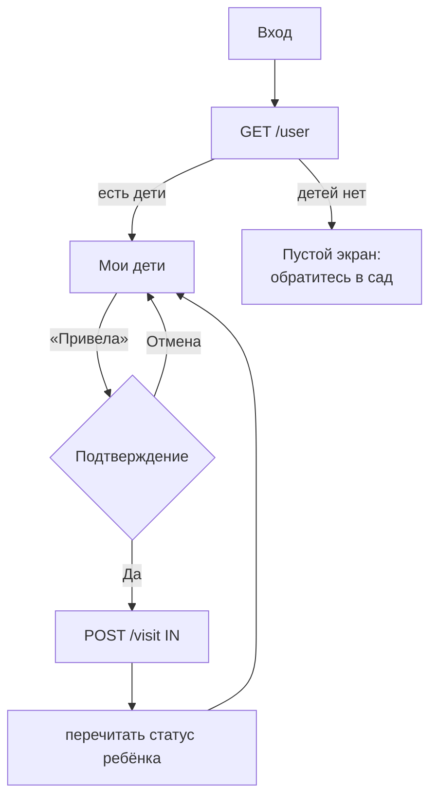
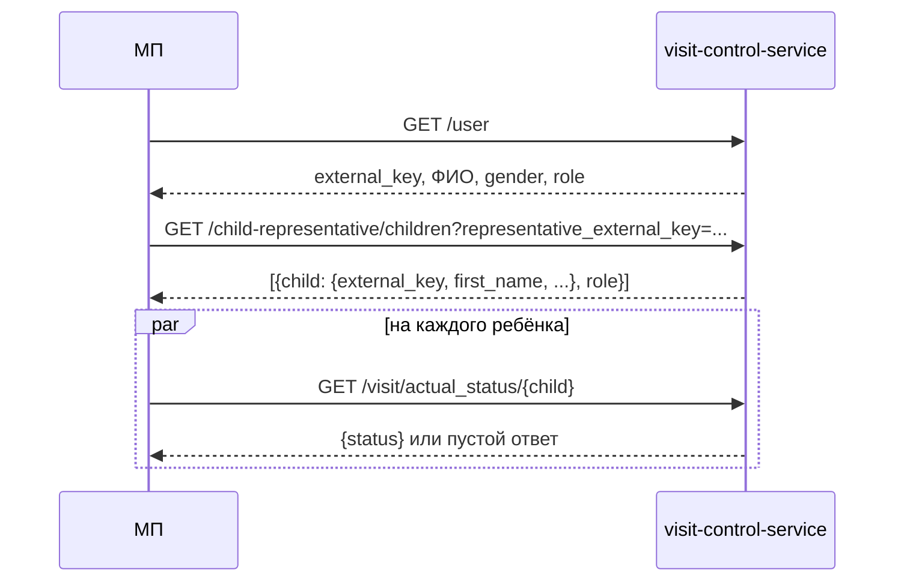

# Экран «Мои дети»

25.09.2026 · Darya Nesterova

Главный экран родителя после входа. На нём список детей, привязанных к пользователю, и текущий статус каждого: в саду или нет. Здесь же родитель отмечает, что привёл ребёнка в сад или забрал его. Детей и связи «ребёнок — представитель» создаёт администратор, родитель на этом экране их не редактирует.

Используются `GET /user`, `GET /child-representative/children`, `GET /visit/actual_status/{key}` и `POST /visit`. API тестового стенда: `http://93.77.168.178/api`, спецификация — `http://93.77.168.178/api/v3/api-docs` (сверено 25.09.2026).

**Статус: реализовано.** Вместе с экраном сделан реальный вход: `POST /token`, затем `GET /user`. Токен пока хранится только в памяти, поэтому после перезапуска приложения нужно войти заново. Хранение в `expo-secure-store` и восстановление сессии — отдельная задача этапа 1 в `backend-integration.md`. На стенде экран не проверен: нужен пользователь с привязанными детьми.

## Что изменилось на бэкенде

С момента `backend-integration.md` часть блокеров снята:

- `GET /user` отдаёт текущего пользователя по токену: `external_key`, ФИО, `gender`, `role`. Отсюда берётся ключ представителя для остальных запросов.
- `GET /child-representative/children` отдаёт в каждой связи объект `child` с ФИО (`UserShortInfoDto`), а не только UUID.
- Ошибки приходят в едином формате `{code, message, errors}`. Нет связи ребёнка с представителем → 400.

Осталось без изменений: `actual_status` не отдаёт время события, `/visit/list` не фильтруется по ребёнку, `POST /visit` не проверяет, что представитель — текущий пользователь, и принимает «привёл» после «привёл».

## Путь пользователя



После входа приложение открывает «Мои дети» вместо текущей заглушки `app/menu.tsx`. Первый вход со сменой пароля описан в `registration-screen.md` и идёт до этого экрана.

## Макет

```
┌─────────────────────────────────────┐
│  Мои дети                     Выйти │
│                                     │
│  ┌───────────────────────────────┐  │
│  │ Мария Иванова                 │  │
│  │ ● В саду                      │  │
│  │ ┌───────────────────────────┐ │  │
│  │ │     Забрала из сада       │ │  │
│  │ └───────────────────────────┘ │  │
│  └───────────────────────────────┘  │
│                                     │
│  ┌───────────────────────────────┐  │
│  │ Пётр Иванов                   │  │
│  │ ○ Не в саду                   │  │
│  │ ┌───────────────────────────┐ │  │
│  │ │     Привела в сад         │ │  │
│  │ └───────────────────────────┘ │  │
│  └───────────────────────────────┘  │
│                                     │
│         ↓ потяните, чтобы обновить  │
└─────────────────────────────────────┘
```

Визуально экран продолжает `auth.tsx` и `register.tsx`: фон `#f5f5f5`, белые карточки со скруглением 10, основная кнопка `#007AFF`. На каждого ребёнка одна карточка; детей в семье обычно 1–3, поэтому хватит `FlatList` без пагинации.

**Карточка ребёнка**

- Имя и фамилия (`first_name surname`). Отчество ребёнку не показываем, оно только удлиняет строку.
- Статус с цветной точкой:

  | Статус из `actual_status` | Подпись | Цвет |
  | --- | --- | --- |
  | `IN` | В саду | зелёный `#2E7D32` |
  | `OUT` | Не в саду | серый `#888` |
  | пустой ответ (отметок ещё не было) | Не в саду | серый `#888` |
  | статус не загрузился | Статус неизвестен · Повторить | серый, ссылка `#007AFF` |

- Одна кнопка с противоположным действием: при `IN` — «Забрала из сада», при `OUT` или без отметок — «Привела в сад». Пока статус неизвестен, кнопка неактивна: нельзя выбрать действие, не зная текущего состояния.
- Глагол согласуется с полом пользователя из `GET /user`: «Привела / Забрала» для `FEMALE`, «Привёл / Забрал» для `MALE`. Если пол не пришёл — «Отметить приход / Отметить уход».

Два разных цвета кнопки для «привёл» и «забрал» не нужны: действие и так понятно из текста, а статус над кнопкой уже выделен цветом.

**Шапка.** Заголовок «Мои дети» и кнопка «Выйти» справа (с подтверждением). Когда появятся профиль, смена пароля и доверенные лица, её заменит меню «⋯». У администратора, который одновременно родитель, в этом меню будет пункт «Режим администратора» (`docs/admin-screens.md`, раздел «Администратор-родитель»).

## Отметка «привёл / забрал»

1. Родитель нажимает кнопку. Появляется диалог с именем ребёнка в заголовке и вопросом «Отметить приход в сад?» (или «Отметить уход из сада?»), кнопки «Отмена» и «Привела в сад» / «Забрала из сада». Пол ребёнка сервер не отдаёт, поэтому вопрос сформулирован без согласования по роду.
2. После подтверждения кнопка этой карточки блокируется и показывает спиннер. Остальные карточки остаются доступны.
3. Приложение перечитывает `GET /visit/actual_status/{child}`. Если статус уже не тот, что видел родитель (например, папа забрал ребёнка с другого телефона), запрос не отправляется. Карточка показывает новый статус и сообщение «Статус уже изменился, проверьте ещё раз».
4. `POST /visit` с `{visitor_external_key: ребёнок, representative_external_key: свой ключ из GET /user, status}`.
5. После ответа 200 статус снова читается с сервера, а не выставляется локально. Короткая вибрация через `expo-haptics` (уже в зависимостях) подтверждает успех.

Диалог подтверждения обязателен: на бэкенде нет удаления отметки, и случайное нажатие нельзя отменить. Поэтому вариант «отметка сразу + кнопка „Отменить“ в плашке» здесь не подходит.

Шаг 3 нужен потому, что бэкенд принимает два «привёл» подряд. Проверка на клиенте не закрывает гонку полностью, но убирает самый частый случай: устаревший экран у второго родителя.

`POST /visit` не повторяется автоматически. Если запрос упал по таймауту, неизвестно, дошёл ли он до сервера. Поэтому после таймаута приложение перечитывает статус: если он сменился — отметка прошла, если нет — показываем ошибку, и родитель повторяет сам.

## Загрузка и обновление



- Список детей и статусы грузятся при открытии экрана. Статусы запрашиваются параллельно, каждая карточка показывает свой результат независимо: ошибка по одному ребёнку не прячет остальных.
- Статусы обновляются, когда экран снова получает фокус (`useFocusEffect`) и когда приложение возвращается из фона (`AppState` → `active`). Второй родитель мог отметить ребёнка, пока приложение было свёрнуто.
- Потянуть вниз (`RefreshControl`) — перечитать и список детей, и статусы.
- GET-запросы повторяются через `retry.ts` при сетевых ошибках и 5xx, как `getPrivacyPolicy()`.
- Дети сортируются по имени, чтобы порядок карточек не прыгал между загрузками.

## Состояния экрана и ошибки

| Ситуация | Что видит пользователь |
| --- | --- |
| Первая загрузка | Спиннер по центру экрана |
| Детей нет (пустой массив) | «К вашему аккаунту пока не привязаны дети. Администратор сада добавит их после проверки заявки» и кнопка «Обновить» |
| Не загрузился профиль или список детей | «Не удалось загрузить данные» и «Повторить» на весь экран |
| Не загрузился статус одного ребёнка | В его карточке «Статус неизвестен · Повторить», кнопка действия неактивна |
| Идёт отметка | Спиннер в кнопке этой карточки, повторное нажатие ничего не отправляет |
| Статус изменился до отправки (шаг 3) | Новый статус в карточке и текст «Статус уже изменился, проверьте ещё раз» до следующего обновления статуса |
| 400: связи с ребёнком больше нет | Диалог «Нет доступа к отметкам этого ребёнка», затем список детей перезагружается |
| Нет сети при отметке | Диалог «Не удалось отметить. Проверьте интернет и попробуйте ещё раз» |
| Таймаут при отметке | Перечитываем статус; не изменился — тот же диалог, что при отсутствии сети |
| 5xx при отметке | Диалог «Не удалось отметить. Попробуйте позже» |
| 401 | Выход на экран входа (интерсептор из этапа 1) |

Для ошибок отметки используется `Alert`, а не текст под кнопкой: это разовое действие, а не форма, и сообщение должно быть замечено сразу.

## Реализация в приложении

| Файл | Что делает |
| --- | --- |
| `app/children.tsx` | экран списка, диалоги подтверждения и ошибок, обновление при фокусе и выходе из фона |
| `app/_layout.tsx` | `Stack.Screen` для `children` с заголовком «Мои дети», без кнопки «назад» |
| `app/auth.tsx` | после входа — `router.replace('/children')` вместо заглушки `/menu` |
| `components/child-card.tsx` | карточка: имя, статус, кнопка действия; `markActionLabel()` согласует глагол с полом |
| `store/types/children.ts` | `Child`, `VisitStatus`, `ChildrenState` |
| `store/types/auth.ts` | `User` — профиль из `GET /user` (ключ, ФИО, пол, роль) |
| `store/reducers/children.ts` | slice: `loadChildren*`, `refreshStatuses`, `loadStatus*`, `markVisit*`; сбрасывается при `logout` |
| `store/sagas/children.ts` | загрузка списка и статусов, отметка с проверкой статуса перед `POST` |
| `store/sagas/auth.ts` | вход: `POST /token` → `GET /user`; учётные данные больше не пишутся в консоль |
| `services/auth/auth-token.ts` | токен сессии в памяти и обработчик 401 |
| `services/api/visit-control-api.ts` | Bearer-заголовок и выход по 401; `login()`; `getMe()`, `getMyChildren()`, `getActualStatus()` — GET с ретраями; `createVisit()` — POST без ретраев |

Профиль хранится в `state.auth.user`, а не в отдельном slice `profile`: сейчас он нужен только для ключа и пола, и приходит вместе со входом.

Модели в camelCase, маппинг из snake_case — внутри `services/api`, как решено в `backend-integration.md`:

```ts
type VisitStatus = 'IN' | 'OUT' | 'NONE'; // NONE — отметок ещё не было

interface Child {
  id: string;           // child.external_key
  firstName: string;
  surname: string;
  linkRole: string;     // role.role связи: PARENT, RELATIVE, ...
}

interface ChildrenState {
  items: Child[];
  listStatus: 'idle' | 'loading' | 'loaded' | 'failed';
  refreshing: boolean;                      // потянули вниз
  statusById: Record<string, {
    value: VisitStatus | null;              // null — не загружен
    loading: boolean;
    error: boolean;
    notice: string | null;                  // «Статус уже изменился»
  }>;
  markingIds: string[];                     // дети, по которым идёт отметка
  markError: { childId: string; message: string } | null; // показывается диалогом
}
```

`markVisit` обрабатывается через `takeEvery`, а не `takeLatest`: отметка по одному ребёнку не должна отменять отметку по другому. Защита от двойного нажатия — через `markingIds`.

## Что нужно на бэкенде

Экран работает и с текущим API, но следующие доработки заметно улучшат его:

| Доработка | Зачем |
| --- | --- |
| Время и представитель в `actual_status` (`datetime`, `representative` как в `VisitFullIntoDto`) | Показать в карточке «В саду с 8:40 · привела Иванова М.» — главный вопрос второго родителя |
| 409 на `IN` после `IN` и `OUT` после `OUT` | Сейчас двойную отметку ловит только клиент, и не во всех случаях |
| `POST /visit` берёт представителя из токена | Сейчас можно отметить посещение от чужого имени |
| `GET /child-representative/my` по токену | Сейчас список детей можно запросить для любого `representative_external_key` |
| Статусы детей одним запросом (например, `status` в ответе `/children`) | Вместо 1 + N запросов при каждом открытии и обновлении |
| Группа ребёнка в ответе `/children` | Подпись «Солнышко» под именем помогает, если детей несколько |

## Открытые вопросы

- Может ли отмечать ребёнка представитель со связью `ACQUAINTANCE` (знакомый)? Бэкенд сейчас разрешает `POST /visit` любому, у кого есть связь и право `VISIT_WRITE`. Если нельзя — карточка показывает только статус, без кнопки.
- Нужна ли кнопка «Привела всех», если детей несколько и они ходят в один сад?
- Нужны ли push-уведомления второму родителю («Марию забрал папа в 17:30»)? Это отдельная задача: на бэкенде нет ни токенов устройств, ни отправки уведомлений.
- Где будет история посещений: отдельный экран по нажатию на карточку? Для этого нужен фильтр `/visit/list` по ребёнку.
