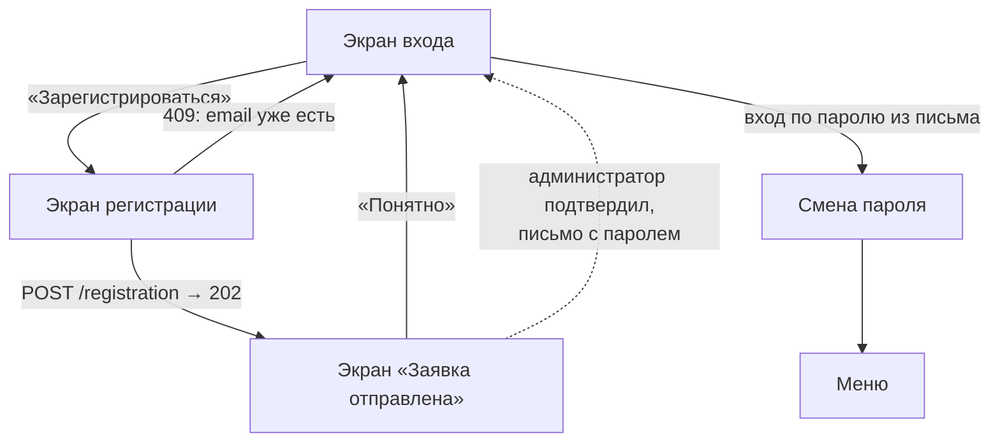

# Экран регистрации пользователя

24.09.2026 · Darya Nesterova

Родитель сам подаёт заявку в приложении. Пароль он не вводит: заполняет данные о себе и даёт согласие на обработку персональных данных. Администратор сада проверяет заявку и подтверждает её. После этого сервер присылает родителю письмо с паролем, и родитель входит обычным образом. Детей и их связь с родителями создаёт только администратор.

Со стороны бэкенда используются `POST /registration` и `GET /registration/policy`, подробности — в `visit-control-service/docs/self-registration.md`.

**Статус: реализовано.** Экран, его логика и проверки сделаны по этому документу. Работать с сервером экран начнёт после деплоя новой версии бэкенда и настройки политики ПДн (`PRIVACY_POLICY_*`). До этого вместо чекбокса согласия показывается «Не удалось загрузить политику», и кнопка отправки неактивна. Шаг «Смена пароля при первом входе» с диаграммы ниже пока не сделан.

## Почему регистрация с проверкой, а не открытая

Родитель видит статусы посещений и может отметить «привёл / забрал». Поэтому человек, зарегистрировавшийся сам, не должен сразу получать доступ к данным детей.

Модерацию администратором всё равно никак не обойти: связь «ребёнок — представитель» создаёт именно он. Статус «на проверке» делает этот шаг видимым для родителя. Без статуса человек увидел бы пустой экран «Мои дети» и не понял бы, что происходит.

Пароль приходит письмом только после подтверждения заявки. Поэтому человек, которого администратор не одобрил, не может даже войти в приложение. Экран «Заявка на проверке» при входе не нужен: у неподтверждённой заявки нет пароля.

## Путь пользователя



Администратор проверяет ФИО и телефон, подтверждает заявку и привязывает родителя к ребёнку. Сервер отправляет письмо с паролем. При первом входе приложение предлагает сменить пароль через `PATCH /user/password`.

## Макет

Одна прокручиваемая форма из двух смысловых блоков. Разбивать на шаги не стоит: полей 7, и один экран проще и в реализации, и в обработке ошибок.

```
┌─────────────────────────────────────┐
│ ←                                   │
│  Регистрация                        │
│  Администратор сада проверит данные │
│  и пришлёт пароль на email          │
│                                     │
│  О ВАС                              │
│  Фамилия                            │
│  ┌───────────────────────────────┐  │
│  │ Иванова                       │  │
│  └───────────────────────────────┘  │
│  Имя                                │
│  ┌───────────────────────────────┐  │
│  │ Мария                         │  │
│  └───────────────────────────────┘  │
│  Отчество                           │
│  ┌───────────────────────────────┐  │
│  │ Петровна                      │  │
│  └───────────────────────────────┘  │
│  ☐ Нет отчества                     │
│  Дата рождения                      │
│  ┌───────────────────────────────┐  │
│  │ 12.03.1990                    │  │
│  └───────────────────────────────┘  │
│  Пол                                │
│  ┌──────────────┬────────────────┐  │
│  │   Женский ●  │    Мужской     │  │
│  └──────────────┴────────────────┘  │
│                                     │
│  КОНТАКТЫ                           │
│  Email                              │
│  ┌───────────────────────────────┐  │
│  │ maria@mail.ru                 │  │
│  └───────────────────────────────┘  │
│  Телефон                            │
│  ┌───────────────────────────────┐  │
│  │ +7 (912) 345-67-89            │  │
│  └───────────────────────────────┘  │
│  На этот адрес придёт пароль        │
│                                     │
│  ☐ Даю согласие на обработку        │
│    персональных данных на условиях  │
│    Политики (ссылка)                │
│                                     │
│  ┌───────────────────────────────┐  │
│  │       Отправить заявку        │  │
│  └───────────────────────────────┘  │
│  Уже есть аккаунт? Войти            │
└─────────────────────────────────────┘
```

Визуально экран повторяет `app/auth.tsx`: белая карточка на `#f5f5f5`, поля с рамкой `#ddd` и скруглением 8, основная кнопка `#007AFF`, заблокированная кнопка `#ccc`. На экране входа под кнопкой «Войти» появляется ссылка «Нет аккаунта? Зарегистрироваться».

## Поля

| Поле | Ввод | Обязательно | Проверка на клиенте | В запросе |
| --- | --- | --- | --- | --- |
| Фамилия | `textContentType="familyName"`, `autoCapitalize="words"` | да | 1–255 символов: буквы, пробел, дефис | `surname` |
| Имя | `textContentType="givenName"` | да | как у фамилии | `first_name` |
| Отчество | `textContentType="middleName"` | нет, если отмечено «Нет отчества» | как у фамилии | `patronymic` (при «Нет отчества» не передаётся) |
| Дата рождения | цифровая клавиатура, маска `ДД.ММ.ГГГГ` | да | реальная дата, возраст 16–100 лет | `birth_date` в формате `YYYY-MM-DD` |
| Пол | переключатель из двух кнопок | да | выбран один вариант | `gender`: `FEMALE` или `MALE` |
| Email | `keyboardType="email-address"`, `autoComplete="email"` | да | формат email, пробелы обрезаются, приводится к нижнему регистру. Подсказка под полем: «На этот адрес придёт пароль» | `email` |
| Телефон | `keyboardType="phone-pad"`, маска `+7 (___) ___-__-__` | да | 10 цифр после +7 | `phone` в виде `+79123456789` |
| Согласие на обработку персональных данных | чекбокс; ссылка на текст политики из `GET /registration/policy` | да (152-ФЗ) | отмечен | `personal_data_consent: {accepted: true, policy_version}` |

Для даты рождения берём маску, а не системный календарь. Дату рождения быстрее набрать цифрами, чем долистать календарь до 1990 года. К тому же маска не требует новой зависимости (`@react-native-community/datetimepicker` в проекте нет).

У полей работает переход по «Далее»: `returnKeyType="next"` и фокус на следующее поле через `ref`. Форма обёрнута в `KeyboardAvoidingView` (`behavior="padding"` на обеих платформах: на Android с `edgeToEdgeEnabled` окно само не сжимается) и `ScrollView`. При открытой клавиатуре форма прокручивается к полю в фокусе.

## Поведение и ошибки

Ошибки показываются текстом красного цвета под своим полем, а не через `Alert`, как сейчас на экране входа. Так пользователь видит все проблемы сразу и не теряет введённые данные. Поле проверяется, когда из него уходит фокус. При нажатии на кнопку проверяются все поля, и экран прокручивается к первому ошибочному.

| Ситуация | Что видит пользователь |
| --- | --- |
| Не заполнены обязательные поля | Кнопка активна. При нажатии под каждым пустым полем появляется «Заполните поле» |
| Идёт запрос | Спиннер в кнопке, поля заблокированы, повторное нажатие не отправляет запрос |
| 202 Accepted | Экран «Заявка отправлена»: «Администратор сада проверит данные. После подтверждения на maria@mail.ru придёт письмо с паролем для входа» и кнопка «Понятно» |
| 409 `POLICY_OUTDATED` | Приложение заново загружает политику, снимает галочку и показывает: «Политика обработки данных обновилась, ознакомьтесь и подтвердите согласие» |
| 429 | Плашка: «Слишком много заявок с этого устройства. Попробуйте через час» |
| Политику не удалось загрузить при открытии экрана | Кнопка неактивна, вместо ссылки текст «Не удалось загрузить политику» и «Повторить». Без версии политики заявку отправить нельзя |
| 409, email уже зарегистрирован | Под полем Email: «Этот email уже зарегистрирован» и ссылка «Войти» |
| 409, телефон уже зарегистрирован | Под полем Телефон: «Этот номер уже зарегистрирован» |
| 400 с ошибками по полям | Текст каждой ошибки под своим полем, по ключу поля из ответа |
| Нет сети или таймаут | Плашка над кнопкой: «Нет соединения с сервером. Проверьте интернет и попробуйте ещё раз». Данные формы сохраняются |
| 5xx | Плашка: «Не удалось зарегистрироваться. Попробуйте позже» |
| Кнопка «назад» при заполненной форме | Диалог «Выйти без сохранения?» |

Запрос регистрации не повторяется автоматически. Повтор после таймаута мог бы создать вторую заявку, если первая на самом деле дошла до сервера. Этот же принцип уже описан для `POST /visit` в `backend-integration.md`.

## Согласие на обработку данных

Перед показом формы приложение загружает `GET /registration/policy`, получает `{version, url}` и показывает ссылку у чекбокса. Ссылка открывается через `expo-web-browser`, он уже есть в зависимостях. В заявку уходит та `version`, текст которой пользователь видел. Сервер сохраняет согласие с этой версией, своим временем, IP и user agent. Поэтому клиент не передаёт ни время, ни «текст согласия».

## Реализация в приложении

| Файл | Что делает |
| --- | --- |
| `app/register.tsx` | экран формы |
| `app/registration-sent.tsx` | экран «Заявка отправлена» |
| `app/_layout.tsx` | два новых `Stack.Screen`; у `register` включён заголовок с кнопкой «назад» |
| `app/auth.tsx` | ссылка «Нет аккаунта? Зарегистрироваться» |
| `components/form-field.tsx` | подпись, поле ввода, текст ошибки. Потом можно переиспользовать на экране входа |
| `components/segmented-control.tsx` | переключатель пола |
| `utils/input-masks.ts` | маски телефона и даты, перевод `ДД.ММ.ГГГГ` → `YYYY-MM-DD`; чистые функции, их легко покрыть тестами |
| `utils/registration-validation.ts` | правила из таблицы «Поля»; возвращает `Record<field, string>` |
| `store/types/registration.ts` | `RegistrationForm`, `RegistrationRequest`, `RegistrationState` |
| `store/reducers/registration.ts` | slice: `loadPolicy*`, `registerStart`, `registerSuccess`, `registerFailure`, `reset` |
| `store/sagas/registration.ts` | вызов API; ошибки 409 и 400 раскладываются по полям |
| `services/api/visit-control-api.ts` | `getPrivacyPolicy()` — GET с ретраями; `register(request)` — `POST /registration` без ретраев, таймаут 10 с |

Состояние slice:

```ts
interface RegistrationState {
  policy: { version: string; url: string } | null;
  policyStatus: 'idle' | 'loading' | 'loaded' | 'failed';
  status: 'idle' | 'submitting' | 'sent';
  fieldErrors: Partial<Record<keyof RegistrationForm, string>>;
  formError: string | null; // сеть, 5xx
}
```

Значения полей хранятся в `useState` экрана, а не в Redux: они нужны только этому экрану. В Redux хранится только результат запроса.

В `store/sagas/auth.ts` сейчас выводится в консоль весь `action.payload` вместе с паролем. Это стоит убрать. Персональные данные из формы регистрации тоже нельзя выводить в консоль.

## Что нужно на бэкенде

Полный проект описан в `visit-control-service/docs/self-registration.md`. Для этого экрана важны:

- `GET /registration/policy` → `{version, url}`, без токена;
- `POST /registration` → `202` / `400 VALIDATION` с `errors` по полям / `409 EMAIL_TAKEN | PHONE_TAKEN | POLICY_OUTDATED` / `429`;
- единый формат ошибок `{code, message, errors}`;
- необязательное отчество.

Экран можно сверстать на моке этих ответов уже сейчас.

## Открытые вопросы

- Нужна ли дата рождения родителя? Сейчас в БД это поле `NOT NULL`, но для родителя оно, скорее всего, лишнее. Если его убрать, в форме останется 6 полей.
- Где администратор подтверждает заявки? На первое время это Swagger. Потом нужен экран списка заявок для роли ADMIN в этом же приложении.
- Кто готовит текст политики обработки ПДн?
